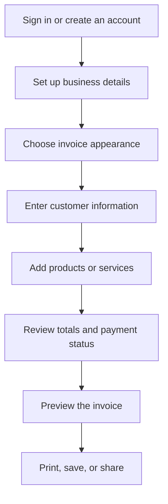

# A typical invoice workflow

```mermaid
flowchart TD
    A[Sign in or create an account] --> B[Set up business details]
    B --> C[Choose invoice appearance]
    C --> D[Enter customer information]
    D --> E[Add products or services]
    E --> F[Review totals and payment status]
    F --> G[Preview the invoice]
    G --> H[Print, save, or share]
```

The flow is intentionally high-level. The application packages and their accompanying setup guides define the exact behavior available in each edition.
